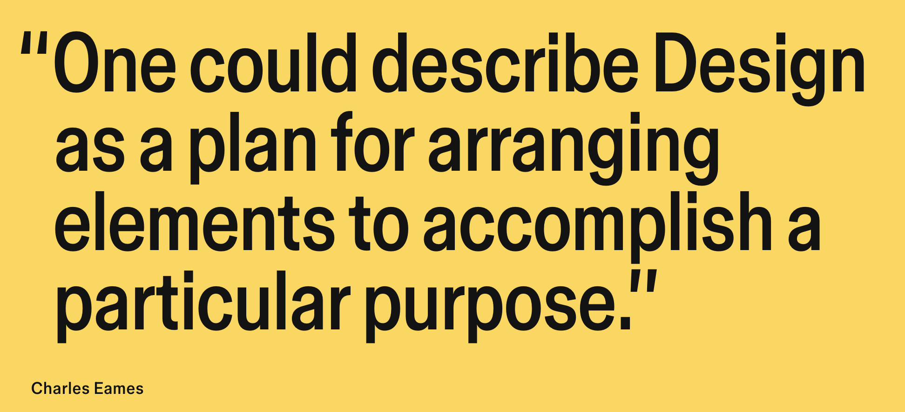

# Nand2Tetris Hardware Design


This repository contains the hardware design files for the "Hack" computer
as described in the popular [nand2tetris](https://www.nand2tetris.org/) course.

The `hdl` folder contains all the hardware designs written in the custom HDL language
that the course uses. The course has an online web IDE where you can write and test out
designs written in their custom HDL at [nand2tetris online IDE](https://nand2tetris.github.io/web-ide/)

But since I'd like to see this computer actually running, I also have the hardware
designs written in Verilog in the `verilog` folder. I hope to eventually have the
entire computer that we've designed here running on an FPGA

There is a `Makefile` in each of those module folders which should help you inspect
the verilog designs.

I'm using an open-source toolchain for developing in Verilog. `iverilog` (Icarus Verilog)
for compiling the verilog files and `gtkwave` for inspecting the resulting digital waveforms
from the test code. So you'll need to install these as well. 
There's more information on these tools below

For example let's say you want to simulate one of the chips in `Module 2`, say the `FullAdder`.

Then just `cd` into the Module folder and type `make <name_of_module>`
```bash
cd verilog/Module\ 2 # There's a backslash here since the name of the folder contains whitespace
make FullAdder
```

## Running the whole computer
- In the `Module 4` folder in the `verilog` folder, the whole Computer comes together and you can write a program in the hack assembly language in the `Module 4/prog.hack` file and then do `make Computer` to test out the `Computer` running the `prog.hack` file.
- The `Module 4` folder has a python script in the `assembler` folder which translate your assembly program into machine code and then the Computer uses a ROM which is filled with the machine code
- And the Computer starts running the instructions in the ROM one by one. We're storing the result of the computation at address 0 in the RAM, which we print in every clock cycle, to check if the result of the computation is correct


## Lecture slides
Additionally the `lectures` folder contains all the lecture slides downloaded from the Coursera
website. If you're someone who prefers watching lecture videos rather than reading a textbook then
there's the [Coursera Nand2Tetris course](https://www.coursera.org/learn/build-a-computer) as well from the same authors

## Future Ideas
Verilog designs can be run on an FPGA. The "Hack" computer is fairly simple and can run on any basic
FPGA. The Lattice ice40 has a completely open-source toolchain "icestorm". So an ice40 FPGA is
highly recommended. This workflow will also be added this repo in the future.



## Learning Resources
If you'd like to learn Verilog then there are some nice free resources online:

> Verilog is a HDL (Hardware Description Language), which can be used to design digital hardware

- [HDLBits](https://hdlbits.01xz.net/wiki/Main_Page) contains practice exercises for Verilog
- [NandLand](https://nandland.com/learn-verilog/)
- [Asic World](https://asic-world.com/)
- [Chip Verify](https://www.chipverify.com/)


## Further courses
- [Digital Systems Laboratory at MIT](https://fpga.mit.edu/6205/F25)
- [Digital Design and Computer Architecture at ETH-Zürich](https://safari.ethz.ch/ddca/spring2025/doku.php?id=schedule)


## Tools used
### iverilog
`iverilog` compiles verilog code, and can be used for executing and simulating
the code.

Source code: https://github.com/steveicarus/iverilog

#### Usage:
If you write your digital logic in `And.v` and test logic in `Test.v`. Then 
compile it like so:
```bash
iverilog -o And And.v Test.v
```
Run it like so:
```bash
./And
```
You'll see the output printed to the console, and also the `Test.vcd` file

### gtkwave
`gtkwave` is for visualizing waveforms.

Source code: https://github.com/gtkwave/gtkwave

#### Usage:
View the waveform like so:
```bash
gtkwave Test.vcd
```

## Other tools

I haven't checked these out yet, but I'd like to in the future

- [Verilator](https://www.veripool.org/verilator/)
- [BlueSpec Compiler](https://github.com/B-Lang-org/bsc)
- [Amaranth](https://github.com/amaranth-lang/amaranth)
- [MyHDL](https://www.myhdl.org/), a HDL in Python!

## A comparison of the HDLs
In this repo, we have implemented the Hack CPU as described in the Nand2Tetris
course in both the Nand2Tetris HDL (an educational HDL, developed by the course
creators) and Verilog (which is an industrial HDL)

There seem to be no for-loops in the Nand2Tetris HDL, and all operations can 
only be executed by chips, and there are no statements like `assign` or even 
logical operators like `~`, `&` and `|` in Verilog. You have the `Nand` chip
given to you (by god) and every other functionality follows from that, starting
with `Not`, `And` and `Or` implemented by using `Nand` chip and then everything
other higher order functionality follows from here

Verilog on the other hand is of course a much more expressive and powerful
language in comparison.
